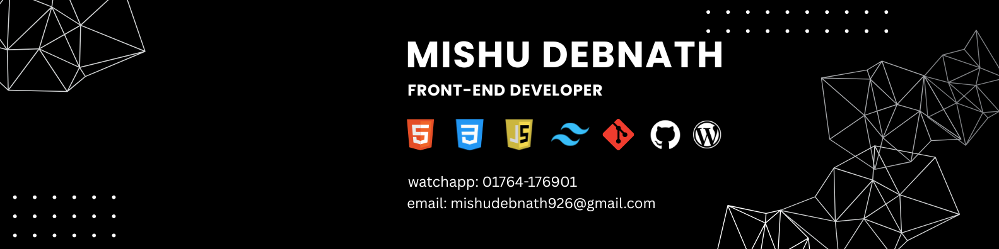

<!-- ============================================This is banner image start ============================================-->
 

<!-- ============================================This is banner image end ============================================-->

 

<!-- =====================================This is banner Header start ========================================================-->
<h1 align="left">
  Hi    
  My name is Mishu Debnath.
</h1>

<!-- =====================================This is banner Header stensart ========================================================-->

- Location: sylhet,bangladesh
- Email: mishudebnath926@gmail.com
<!-- about  -->

---

## 📍 About Me

I am a passionate frontend developer from Bangladesh 🇧🇩

I love building modern and responsive web applications.

- 🌱 I’m currently learning MERN Stack Development
- 📚 I’m practicing JavaScript, React & backend basics
- 🎯 My goal is to become a full-stack developer
- ⚡ Fun fact: I love clean UI & simple design

---

<!-- =============================This is Skil Icon section===========================================-->

## 🛠️ Skills

  
  
  
  
  
  
  
  
  
  
  
  

<!-- =============================This is Skil Icon end===========================================-->

## <!-- ====================================This is Social Media Icon start =====================================-->

## 🌐 Connect with Me

  
  
  

<!-- ====================================This is Social Media Icon end =====================================-->

### 🎨 Tools

- VS Code
- Figma

---

- 💼 LinkedIn: https://www.linkedin.com/in/mishudeb
- 📧 Email: mishudebnath926@gmail.com
- 📱 Facebook: https://web.facebook.com/devmishunath

---

###

<!-- ============================================This is Visitor Section start ===========================================-->

<!-- ============================================This is Visitor Section end ===========================================-->

<!-- ============================================This is Graph Section start ===========================================================-->

  

---

⭐ Thanks for visiting my profile!

<!-- ============================================This is Graph Section end ===========================================================-->
